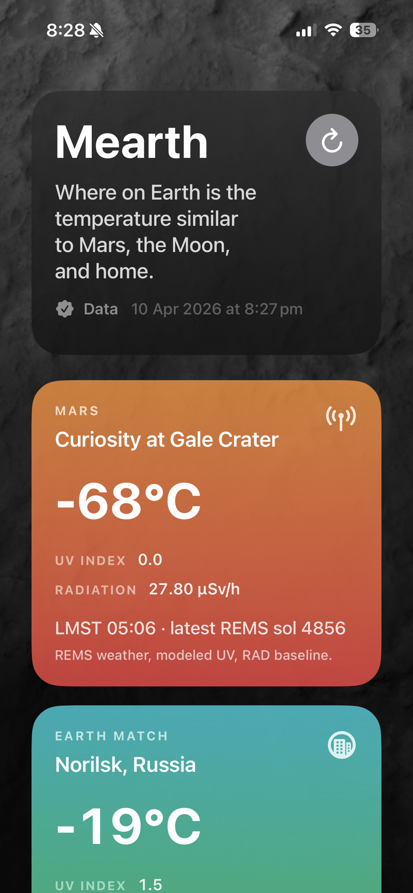
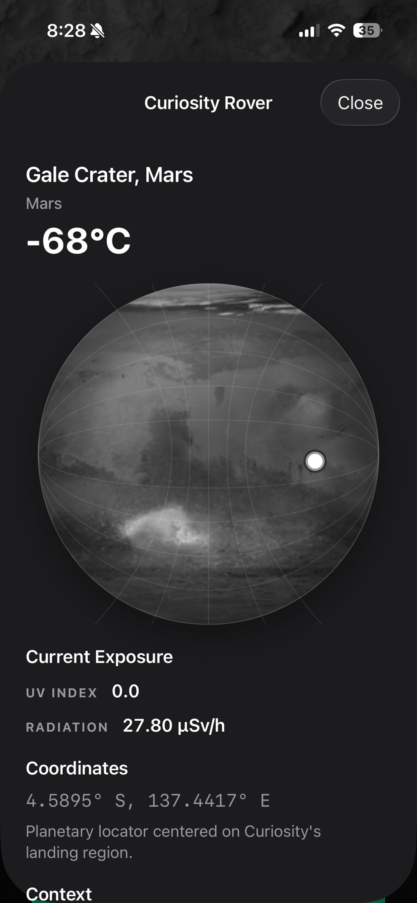
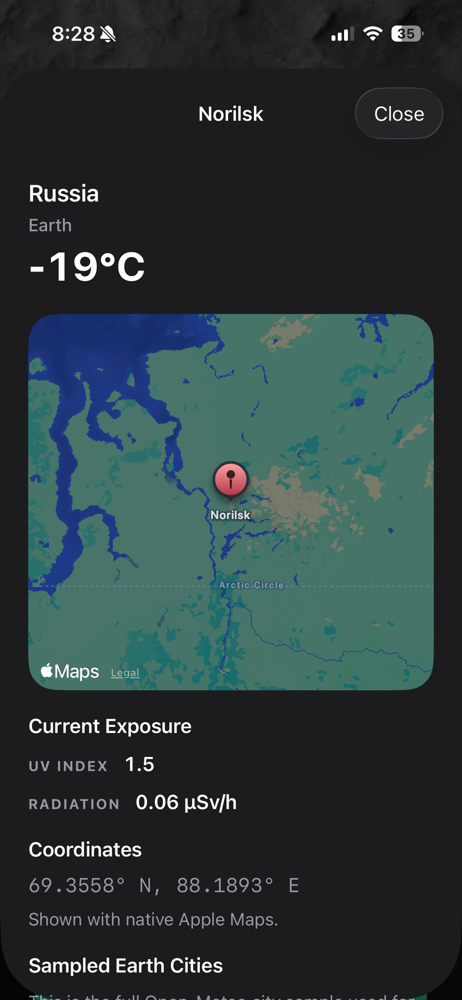
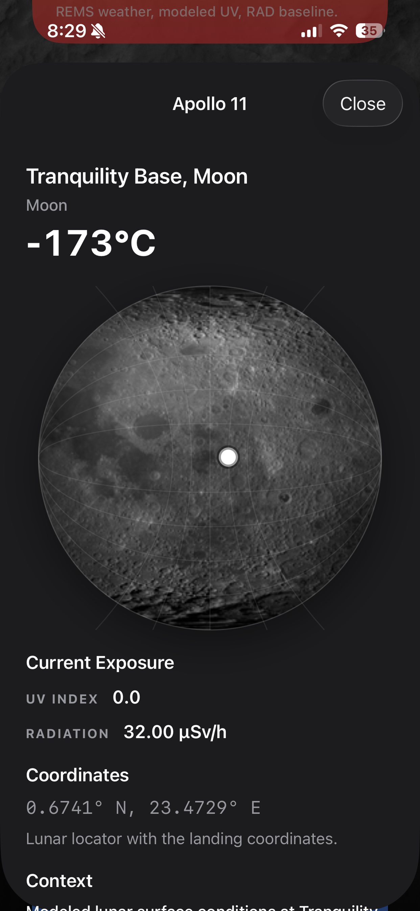

# Mearth

Where on Earth is the temperature similar to Mars, the Moon, and home?

Mearth is a SwiftUI app for iPhone, iPad, Mac, Apple TV, widgets, and iOS Live Activities.

Based on our [2013 NASA SpaceApps Challenge](https://github.com/sighmon/mearth)

Test Flight: https://testflight.apple.com/join/T2J3xSeS

## Functionality

- Dashboard with four cards:
  - `Mars`: latest Curiosity weather at Gale Crater
  - `Earth Match`: closest sampled Earth city temperature to Mars
  - `Moon Estimate`: modeled Apollo 11 / Tranquility Base conditions
  - `Local`: current temperature near the user
- Temperature, UV, and radiation comparison:
  - Earth and local UV are live when available
  - Mars and Moon UV are modeled as Earth-style UV Index equivalents
  - Radiation is shown separately in `µSv/h`
- Temperature units:
  - app-wide automatic region detection
  - manual `°C` / `°F` override from the Local modal
- Tap-through modals:
  - Earth uses native Apple Maps
  - Mars and Moon use interactive SceneKit globes with curated mission / landing sites
  - modals include coordinates, context, and source links
- Widgets and Live Activities:
  - Home Screen / macOS widgets
  - Lock Screen accessory widgets
  - Dynamic Island / Live Activity on iPhone
- Resilience:
  - last successful results are cached
  - cached data is shown when a source fails
  - the UI indicates when data is cached / stale
- Development support:
  - dashboard preview/mock mode
  - Xcode previews for the app views and widget families

## Data Sources

- Mars weather:
  - CAB / INTA-CSIC Curiosity REMS widget feed
  - `http://cab.inta-csic.es/rems/wp-content/plugins/marsweather-widget/api.php`
- Earth match:
  - Open-Meteo sampled city comparison set
- Local weather:
  - Apple Location Services for coordinates
  - Apple Weather / WeatherKit when available
  - Open-Meteo fallback
  - IP geolocation fallback via `ipapi.co`, then `ipwho.is`
- Moon:
  - modeled estimate for Apollo 11 / Tranquility Base based on local solar angle
- Radiation / UV context:
  - NASA / JPL, NASA UV references, and Apollo-era lunar radiation references are linked in-app in the location modal

## Privacy

- The app requests location permission only to show the local weather card and to auto-detect the preferred temperature unit by region.
- When location access is granted, the app uses the device's approximate/current location to look up local weather.
- If Apple location or WeatherKit data is unavailable, the app can fall back to IP-based geolocation via `ipapi.co` and `ipwho.is` so the local card is still usable.
- The app does not use location for advertising, profiling, or background tracking.

## Build

- `xcodebuild -project Mearth.xcodeproj -scheme Mearth -destination 'generic/platform=iOS Simulator' CODE_SIGNING_ALLOWED=NO build`
- `xcodebuild -project Mearth.xcodeproj -scheme Mearth -destination 'generic/platform=tvOS Simulator' CODE_SIGNING_ALLOWED=NO build`
- `xcodebuild -project Mearth.xcodeproj -scheme Mearth -destination 'generic/platform=macOS' CODE_SIGNING_ALLOWED=NO build`
